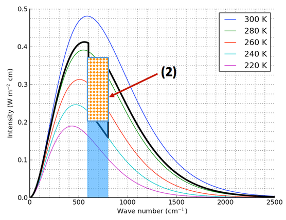
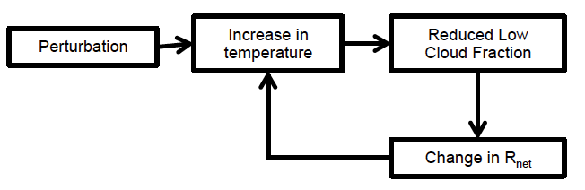
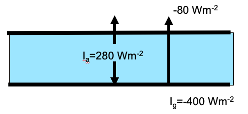

---
jupytext:
  cell_metadata_filter: all
  cell_metadata_json: true
  encoding: '# -*- coding: utf-8 -*-'
  formats: ipynb,md:myst,py:percent
  notebook_metadata_filter: all,-language_info,-latex_envs,-toc
  text_representation:
    extension: .md
    format_name: myst
    format_version: '0.10'
    jupytext_version: 1.5.2
kernelspec:
  display_name: Python 3
  language: python
  name: python3
---

+++ {"ctype": "question", "quesnum": 1, "answer": "B"}

Q1) We notice the planet loses about $5 \times 10^{5}\ km^{2}$ of ice
    area for each 1 K change in surface temperature. Further, the
    change in radiative forcing per square kilometre of arctic ice
    ∆R/∆(ice area) is $-10^{−6} W m^{- 2}/km^{2}$. Use this
    information to calculate the strength of the ice-albedo feedback
    $f_{ice}$. Choose the closest answer.

   A) 0.2 $\text{Wm}^{- 2}K^{- 1}$

   B) 0.5 $\text{Wm}^{- 2}K^{- 1}$

   C) 0.75 $\text{Wm}^{- 2}K^{- 1}$

   D) 2 $\text{Wm}^{- 2}K^{- 1}$

   E) 5 $\text{Wm}^{- 2}K^{- 1}$

+++ {"answer": "B", "ctype": "question", "quesnum": 1}

**Q1 answer B)**

\begin{align*}
f_{ice} =  \left( \frac { \Delta R } { \Delta \text {climate } } \right) \left( \frac { \Delta \text { climate } } { \Delta T } \right)
\end{align*}

```{code-cell} ipython3
:answer: B
:ctype: answer
:quesnum: 1

-5.0e5 * (-1.0e-6)  # B
```

+++ {"ctype": "question", "quesnum": 2, "answer": "D"}

Q2) Suppose a climate scientist establishes that her group’s model
    has a total climate sensitivity of λ=0.65 K/($Wm^{-2}$). She then
    makes a change to the cloud routine that increases the strength of
    the cloud feedback from +0.5 $\text{Wm}^{- 2}K^{- 1}$ to +0.75
    $\text{Wm}^{- 2}K^{- 1}$. What is the new total feedback of the
    model?

   A) 0.90 $\text{Wm}^{- 2}K^{- 1}$

   B) -0.90 $\text{Wm}^{- 2}K^{- 1}$

   C) 1.29 $\text{Wm}^{- 2}K^{- 1}$

   D) -1.29 $\text{Wm}^{- 2}K^{- 1}$

   E) 1.79 $\text{Wm}^{- 2}K^{- 1}$

```{code-cell} ipython3
:answer: D
:ctype: question
:quesnum: 2

f = -1 / 0.65
f_new = f + 0.25
lambda_new = 1 / f_new
print(lambda_new, f_new)  # D
```

+++ {"ctype": "question", "quesnum": 3, "answer": "A"}

Q3) How long does it take for a constant forcing of 3 $W\,m^{- 2}$ to
    warm a 150 m thick ocean layer by 0.75 K? (A year has 31,536,000
    seconds)

   A) 5 years

   B) 7.5 years

   C) 10 years

   D) 15 years

   E) 25 years

```{code-cell} ipython3
:answer: A
:ctype: answer
:quesnum: '3'

D = 150
cw = 4186
rhow = 1000.0
delTemp = 0.75
delF = 3
delt = rhow * D * cw * delTemp / delF
sec2years = 1 / (31536000)
print(delt * sec2years)  # A
```

+++ {"ctype": "question", "quesnum": 4, "answer": "E"}

Q4) Imagine we end up burning the rest of the available coal (2800 Gton
    carbon) **and** the oil and natural gas (200 Gton carbon), but we
    don’t burn any other fossil carbon. What will the atmospheric
    concentration of $CO_2$ be when we’re finished? Assume we
    burn everything instantaneously, that all of the emitted carbon
    stays in the atmosphere, and that today’s atmospheric $CO_2$
    concentration is 400 ppm.

   A) about 580 ppm  
   B) about 640 ppm  
   C) about 1050 ppm  
   D) about 1200 ppm  
   E) about 1830 ppm

```{code-cell} ipython3
:answer: ' '
:ctype: question
:quesnum: ' '

3000 / 2.1  # E
```

+++ {"ctype": "question", "quesnum": 5, "answer": " "}

Q5) For the figure below, pick the most accurate description of the
    rectangular region labeled (2).  Assume the instrument is looking down from the top of this atmosphere

   

   A) The radiation emitted by the gas that reaches the top of the atmosphere
   B) The radiation absorbed by the gas
   C) The greenhouse effect from the gas in this wavenumber range
   D) The surface radiation absorbed by the gas  gas
   E) The radiation emitted by the gas that reaches the surface

+++ {"ctype": "question", "quesnum": 6, "answer": " "}

Q6) For this feedback loop:




  Choose the best characterization, keeping in mind that feedbacks
  work in both directions.  ($R_{net}$ is the net downward radiation at the top of the atmosphere)

   A) Amplifying because increasing low clouds heat the surface through
      longwave emission
   B) Stabilizing because increasing low clouds reduce the surface heat
      flux
   C) Amplifying because increasing low clouds reflect more incoming
      shortwave
   D) Amplifying because increasing low clouds increase atmospheric
      mixing
   E) Stabilizing because increasing low clouds emit more radiation to
      space

+++ {"ctype": "question", "quesnum": 6, "answer": " "}

#C

+++ {"ctype": "question", "quesnum": 7, "answer": " "}

Q7) Consider the following shallow, nocturnal atmospheric layer with
    emissivity **$ε_a$=0.8** over ground with emissivity of ε=1. If
    the ground temperature $T_g$ is 300 K and the air
    temperature $T_a$ is 260 K, what is the heating/cooling rate
    **of the ground** in $W\,m^{-2}$?

   **(Note 250 $W\,m^{-2}$ in longwave flux is entering the layer from above)**

   **Shortcut:  $\sigma \times 300^4 = 460\ W\,m\,^2$**


   


   A) -251 $W\,m^{-2}$
   B) -202 $W\,m^{-2}$
   C) +101 $W\,m^{-2}$
   D) +202 $W\,m^{-2}$
   E) +251 $W\,m^{-2}$

```{code-cell} ipython3
:answer: ' '
:ctype: question
:quesnum: 7

sigma = 5.67e-8
250 * (1 - 0.8) + 0.8 * sigma * 260 ** 4.0 - 460.0  # B
```

+++ {"ctype": "question", "quesnum": 8, "answer": " "}

Q8) Which of the following climate feedbacks are always stabilizing?

    i. Water vapour feedback
    ii. Lapse rate feedback
    iii. Planck feedback
    iv. cloud feedback

   A) i, iii
   B) ii,iii
   C) iv
   D) i, iii, iv
   E) ii, iv

+++ {"ctype": "question", "quesnum": 8, "answer": "B"}

#B

+++ {"ctype": "question", "quesnum": 9, "answer": " "}

Q9) Given the fluxes in the following figure, the Greenhouse effect of
    this atmosphere is

   

   A) 20 $W\,m^{-2}$  
   B) 40 $W\,m^{-2}$  
   C) 120 $W\,m^{-2}$  
   D) 320 $W\,m^{-2}$  
   E) 400 $W\,m^{-2}$

```{code-cell} ipython3
:answer: ' '
:ctype: question
:quesnum: 9

-280 - 80 + 400  # B
#
```

+++ {"answer": " ", "ctype": "question"}

\begin{align}
\text{Layer energy equation:} ~~~ & \frac { d E } { d t } = I _ { \downarrow } + I _ { \uparrow }\\
\text{Solar constant:}~~~& S= \frac { S _ { 0 } } { 4 } ( 1 - \alpha )\\
\text{Total grey body flux} ~~~ & I = \varepsilon \sigma T ^ { 4 }\\
&\text{where} ~~~ \sigma = 5.67 \times 10 ^ { - 8 } \mathrm { Wm } ^ { - 2 } \mathrm { K } ^ { - 4 }\nonumber\\
\text{transmissivity tr:}~~~& I _ { \text {transmitted } } = \mathrm { tr } I _ { 0 }\\
\text{reflectity}~ \alpha~~~ & I _ { \text {reflected } } = \alpha I _ { 0 } \\
\text{absorbtivity abs} ~~~ & I _ { \text {absorbed} } = \text{abs} I _ { 0 }\\
\text{Kirchoff's law} ~~ & \varepsilon = \text{abs} \\
\text{$CO_2$ radiative forcing} ~~~& \Delta F = \left(3.8 \mathrm{W} \mathrm{m}^{ - 2 } \right) \frac { \ln ( \text {newp} \operatorname { CO } 2 / \text { origp } \mathrm { CO } 2 ) } { \ln ( 2 ) } \\
\text{Conservation of Energy:}~~~&\alpha \mathrm { I } _ { 0 } + a b s \mathrm { I } _ { 0 } + \mathrm { trI } _ { 0 } = \mathrm { I } _ { 0 }\\
\text{moist static energy:}~~~ & h _ { m } = c _ { p } T + l _ { v } w _ { v } + g z \\
\text{moist adiabatic lapse rate:}~~~&\Gamma = \frac { d T } { d z } = \frac { - g } { c _ { p } + l _ { v } \frac { d w _ { v } } { d T } }\\
\text{hydrostatic balance:}~~~&d p = - \rho g d z \\
\text{mass in a layer in $kg/m^2$:}~~~&M = \int _ { z _ { 1 } } ^ { z _ { 2 } } \rho(z) d z\\
\text{energy in an ocean layer:}~~~&\Delta E=\rho_{w} D c_{w} \Delta T\\
\text{Conservation of energy for layer:}~~~&\frac{d \Delta E}{d t}=\Delta F\\
\text{change of temperature for an ocean layer:}~~~&\frac{d \Delta T}{d t}=\frac{\Delta F}{\rho_{w} c_{w} D}\\
\text{Planck feedback:}~~~&\frac { d I _ { G } } { d T } = \frac { d \left( - \sigma T ^ { 4 } \right) } { d T } = f_{planck} =- 4 \sigma T ^ { 3 } = - 1 / \lambda\\
\text{Conservation of energy with feedback:}~~~&
\frac { \Delta E } { d t } = \Delta F - 4 \sigma T ^ { 3 } \Delta T\\
\text{Climate adjustment to abrupt forcing:}~~~&\Delta T ( t ) = \lambda \Delta F \left( 1 - e ^ { - t / \tau } \right) \\
\text{Climate adjustment timescale:}~~~&\tau = \rho _ { w } c _ { w } D \lambda\\
\text{Climate sensitivity:}~~~&\Delta T = \lambda \Delta F\\
\text{Climage mean temperature budget:}~~~&\rho _ { w } c _ { w } D \frac { d T } { d t } = \Delta F + \sum f _ { n } \Delta T\\
\text{Climate feedback factor:}~~~&f _ { n } = \frac { \Delta R } { \Delta T } = \left( \frac { \Delta R } { \Delta \text { climate } } \right) \left( \frac { \Delta \text { climate } } { \Delta T } \right)\\
\text{Climate sensitivity with feedbacks:}~~~&\lambda = - \frac { 1 } { \sum f _ { n } }
\end{align}

+++ {"answer": " ", "ctype": "question"}

# Quiz 2 constants

\begin{align}
&\text{1 ppm = 2.1 Gtonnes Carbon = 7.6 Gtonnes $CO_2$}\\
\sigma  &= 5.67 \times 10 ^ { - 8 } \mathrm { Wm } ^ { - 2 } \mathrm { K } ^ { - 4 }\\
c_p  &= 1004\ J\,kg^{-1}\,K^{-1} \\
c_w  &= 4186\ J\,kg^{-1}\,K^{-1} \\
\rho_w &= 1000\ kg\,m^{-3}\\
l_v &= 2.5 \times 10^6\ J\,kg^{-1}
\end{align}
